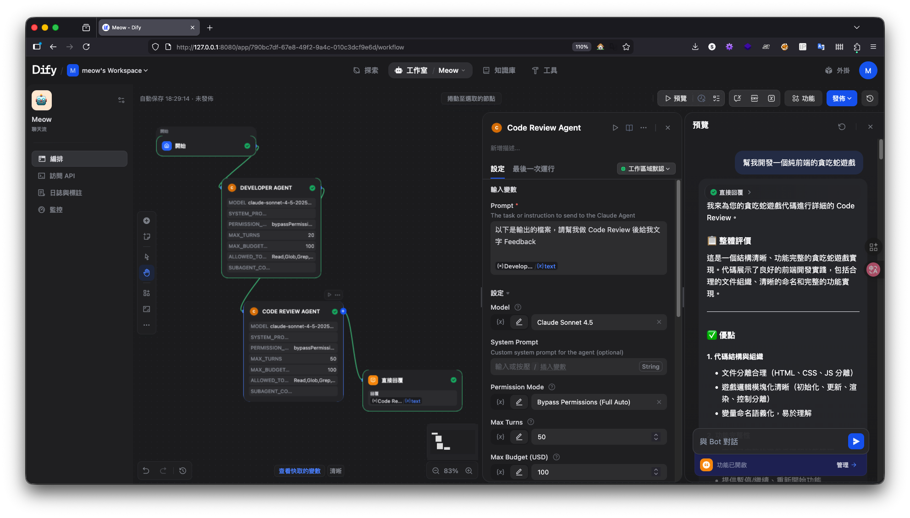

# Dify Claude Agent Plugin

A Dify plugin that integrates [Claude Agent SDK](https://platform.claude.com/docs/en/agent-sdk/overview),
enabling autonomous Claude Agents as tool nodes in Dify workflows.



## Prerequisites

- Dify 1.9+ with Plugin support enabled
- Anthropic API Key, Claude Code OAuth Token, or Custom Endpoint credentials

## Installation (Docker Deployment)

If your Dify is running via Docker Compose, use the automated setup script:

### Quick Setup (Recommended)

```bash
cd quick-start
./setup.sh /path/to/dify/docker
```

This script will:
1. Patch the plugin daemon with Node.js 22 + Claude CLI + gosu wrapper
2. Disable plugin signature verification (required for custom plugins)
3. Build and restart the plugin daemon container

See [`quick-start/README.md`](quick-start/README.md) for manual setup steps and details.

### Install the Plugin

1. Package the plugin (requires [Dify CLI](https://github.com/langgenius/dify-plugin-daemon/releases)):
   ```bash
   # Install Dify CLI (macOS)
   brew tap langgenius/dify && brew install dify
   # Or download binary directly from GitHub releases

   # Package
   dify plugin package ./dify-claude-agent
   ```
2. Open Dify UI → **Plugins** → **Install Plugin** → **Local Upload**
3. Upload `dify-claude-agent.difypkg`
4. Configure credentials (one of):
   - **Anthropic API Key** (`sk-ant-...`)
   - **Claude Code OAuth Token**
   - **Custom Endpoint** (Base URL + Auth Token) — see below

### Custom Endpoint (Proxy) Configuration

To route requests through a proxy service (Requesty, OpenRouter, etc.), set these provider credentials:

| Credential | Type | Required | Example |
|------------|------|----------|---------|
| Custom API Base URL | text | Yes | `https://router.requesty.ai` |
| Custom Endpoint Auth Token | secret | Yes | Your proxy API key |

Both fields must be provided together. Do **not** include `/v1` in the Base URL — it is added automatically.

When using a custom endpoint, you must manually enter the model name (e.g., `claude-4.6-sonnet`) in the tool node's **Model** parameter. The preset model values are not compatible with proxy services.

## Usage

### Basic Agent Node

1. Add "Claude Agent" tool to your Dify workflow
2. Configure model, allowed tools, and budget
3. Connect the prompt input
4. Connect output to downstream nodes

### Chaining Agents

Connect multiple Claude Agent nodes in sequence.
Each node receives the previous agent's output as context:

```
[Start] -> [Agent: Research] -> [Agent: Summarize] -> [Agent: Write] -> [End]
```

### Subagent Configuration

Enable in-node delegation by providing a JSON config:

```json
{
  "researcher": {
    "description": "Expert at finding information",
    "prompt": "Research the given topic thoroughly",
    "tools": ["Read", "WebSearch", "WebFetch"],
    "model": "haiku"
  }
}
```

## Parameters

| Parameter | Type | Default | Description |
|-----------|------|---------|-------------|
| prompt | string | (required) | Task for the agent |
| model | string | claude-sonnet-4-5 | Claude model to use |
| system_prompt | string | - | Custom system prompt |
| permission_mode | select | bypassPermissions | Agent permission level |
| max_turns | number | 10 | Max agent turns |
| max_budget_usd | number | 1.0 | Spending limit (USD) |
| allowed_tools | string | Read,Glob,Grep,WebSearch,WebFetch | Tools the agent can use |
| subagent_config | string | - | JSON subagent definitions |

### Available Tools

`Read`, `Write`, `Edit`, `Bash`, `Glob`, `Grep`, `WebSearch`, `WebFetch`, `Task`, `NotebookEdit`, `AskUserQuestion`, `TodoWrite`

## Output

The tool returns:

- **Text**: The agent's final text output (streamed in real-time)
- **JSON**: Structured metadata
  ```json
  {
    "result": "agent's text output",
    "cost_usd": 0.05,
    "duration_ms": 12345,
    "is_error": false,
    "session_id": "abc-123",
    "num_turns": 5
  }
  ```

## Development

### From Source (Debug Mode)

```bash
cd dify-claude-agent
pip install -r requirements.txt
cp .env.example .env
# Edit .env with your Dify debug credentials
python -m main
```

### Run Tests

```bash
cd dify-claude-agent
python -m pytest tests/ -v
```

## License

MIT
